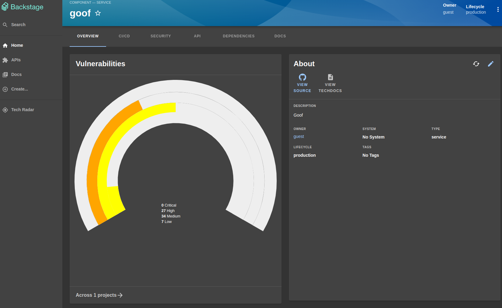

# Snyk Backstage Plugin

[](https://gist.github.com/cheerfulstoic/d107229326a01ff0f333a1d3476e068d)

**This repository is in maintenance mode, no new features are being developed. Bug & security fixes will continue to be delivered. Open source contributions are welcome for small features & fixes (no breaking changes)**

The Snyk plugin displays security details from [snyk.io](https://snyk.io/).


## Getting started

> **Requirements: Snyk API enabled (Paid plans only)**

1. Install plugin

```bash
# packages/app
yarn add --cwd packages/app backstage-plugin-snyk
```

2. Add plugin to the app

```typescript
// packages/app/src/App.tsx
import { EntitySnykContent } from 'backstage-plugin-snyk';

....

<FlatRoutes>
...
<Route path="/snyk" element={<EntitySnykContent />}/>
...
</FlatRoutes>

```

3. Add Snyk card and tab to the entity page
   The plugin is composed of 2 main parts

- Snyk tile on the entity overview page
- Security tab in the entity displaying further details

a. Import the elements

```typescript
// packages/app/src/components/catalog/EntityPage.tsx
import {
  SnykOverview,
  EntitySnykContent,
  isSnykAvailable,
} from "backstage-plugin-snyk";
```

b. Add the overview card\
\


```typescript
// packages/app/src/components/catalog/EntityPage.tsx
const entityWarningContent = (
  <>
    ...
    <EntitySwitch>
      <EntitySwitch.Case if={isSnykAvailable}>
        <Grid item md={3}>
          <SnykOverview />
        </Grid>
      </EntitySwitch.Case>
    </EntitySwitch>
    ...
  </>
);
```

c. Add the tab (feel free to rename title to Security, snyk, vulns, whatever you think is best)

```typescript
const ServiceEntityPage = (
  <EntityLayoutWrapper>
    ...
    <EntityLayout.Route path="/snyk" title="Security">
      <EntitySnykContent />
    </EntityLayout.Route>
    ...
  </EntityLayoutWrapper>
);
```

4. Add snyk proxy config to app-config.yaml file at the root directory. If using Snyk self hosted, adjust target to https://YOURHOSTNAME/api. User Agent helps us see how much API traffic comes from backstage setups so we can invest more in the plugin !

```yaml
proxy:
  endpoints:
    ...
    /snyk:
      # Host of the API to use on the calls.
      # If you use EU or AU Snyk account, change this to https://api.eu.snyk.io/ or https://api.au.snyk.io/
      target: https://api.snyk.io/
      headers:
        User-Agent: tech-services/backstage-plugin/1.0
        Authorization: token ${SNYK_TOKEN}
    ...
```

You can also add the following optional configuration to your app-config.yaml

```yaml
snyk:
  # Host of the Web UI to render links. Defaults to "app.snyk.io"
  # If you use EU or AU Snyk account, change this to app.eu.snyk.io or app.au.snyk.io
  appHost: app.snyk.io
  # Version of the API to use on the calls. Defaults to "2023-11-06"
  apiVersion: 2023-11-06
  # Mocks the API calls, useful for development and for testing the plugin without a Snyk account. Defaults to "false"
  mocked: false
  # Will show resolved issues in all the graphs. Defaults to "false" to show only non-resolved issues
  showResolvedInGraphs: false
```

5. Get your Snyk token (a service account with Viewer permission at your group level is preferred) and provide SNYK_TOKEN env var with the value "<YOURTOKEN>"

```bash
export SNYK_TOKEN="123-123-123-123"
```

6. Add this following annotation to your entities.

- `snyk.io/org-id` is the ID of the Snyk organization where your project is. You can find the ID in the Organization Settings in the Snyk dashboard.

7. Then add one or more than one of the following annotations to your entities.

- `snyk.io/target-id` specify a single target by name or ID. Target ID will avoid an API call and be therefore faster. Use this [API endpoint](https://apidocs.snyk.io/?version=2023-06-19%7Ebeta#get-/orgs/-org_id-/targets) to get the Target IDs.
- `snyk.io/targets` specify one or more targets, by name or ID. Target ID will avoid an API call and be therefore faster. Use this [API endpoint](https://apidocs.snyk.io/?version=2023-06-19%7Ebeta#get-/orgs/-org_id-/targets) to get the Target IDs.
- `snyk.io/project-ids` are the project ID (see slug in url or ID in project settings)
  If multiple projects (like multiple package.json or pom files, add them with increasing number), add them comma separated
- `snyk.io/exclude-project-ids` to exclude specific projects you might not want.
  ....

Example:

```yaml
apiVersion: backstage.io/v1alpha1
kind: Component
metadata:
  name: goof
  description: Goof
  annotations:
    snyk.io/org-id: 361fd3c0-41d4-4ea4-ba77-09bb17890967
    snyk.io/targets: Snyk Demo/java-goof,508d2263-ea8a-4e42-bc9d-844de21f4172
    snyk.io/target-id: aarlaud-snyk/github-stats
    snyk.io/project-ids: 7439e322-f9c1-4c42-8367-002b33b9d946,db066cb9-b373-46da-b918-b49b541e0d63
    snyk.io/exclude-project-ids: 4737fc9c-3894-40ba-9dc5-aa8ae658c9f6,38e02916-0cf7-4927-ba98-06afae9fef36
spec:
  type: service
  lifecycle: production
  owner: guest
  ....
```

Some more examples can be found in [here](https://github.com/snyk-tech-services/backstage-plugin-snyk/tree/develop/test/fixtures)

## Migration steps from plugin version 1.x to 2.x

- Update the proxy target to not contain /v1

## Troubleshooting

- Missing or wrong token set in the backend proxy.\

  

- 404s from Snyk API? Add [pathRewrite your app-config.yaml proxy](https://github.com/snyk-tech-services/backstage-plugin-snyk/issues/11) to the following

```yaml
"/snyk":
  target: https://api.snyk.io/
  headers:
    User-Agent: tech-services/backstage-plugin/1.0
    Authorization:
      $env: SNYK_TOKEN
  pathRewrite:
    "^/proxy/snyk/": "/"
```

## Limitations

Infrastructure as Code and Snyk Code projects are not supported currently.
